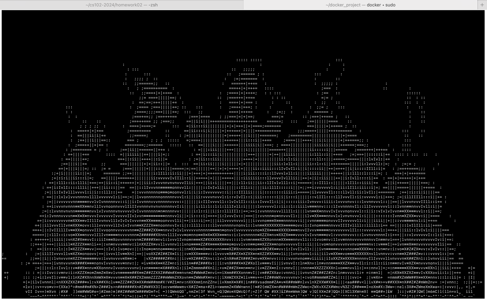
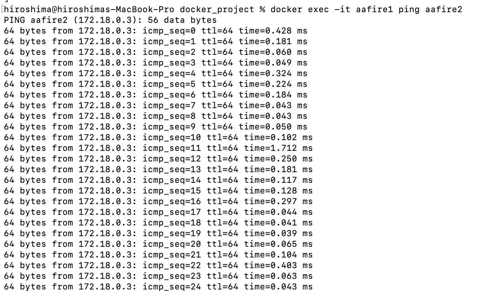

# Лабораторная работа №4 Пластинина Мария К3161
1) Сначала я установила Docker Desktop на macOS и убедилась, что программа успешно запускается.

2) Для работы я создала отдельную директорию, чтобы все файлы проекта находились в одном месте. Затем я добавила в эту директорию файл с названием Dockerfile, который будет содержать инструкции для сборки образа.

3) В файле Dockerfile я прописала инструкции, которые указывают, какой базовый образ использовать (в данном случае Debian), какие пакеты установить (утилиты для работы aafire и ping), а также как запустить приложение aafire.

4) После написания и сохранения файла я приступила к сборке образа. Сборка прошла успешно, и в результате я получила готовый образ под названием aafire_image. 

5) Следующим шагом я запустила два контейнера из созданного образа. Это нужно было для проверки работы приложения aafire и тестирования связи между ними.

6) Чтобы объединить контейнеры в одну сеть, я создала пользовательскую сеть под названием myNetwork. После этого я подключила оба контейнера к этой сети. 

7) Для проверки связи между контейнерами я использовала утилиту ping, которая была предварительно установлена в контейнерах через Dockerfile. Сначала я подключилась к первому контейнеру, затем попыталась отправить запросы ко второму контейнеру. Связь была установлена успешно, что подтвердило правильность настройки сети.

